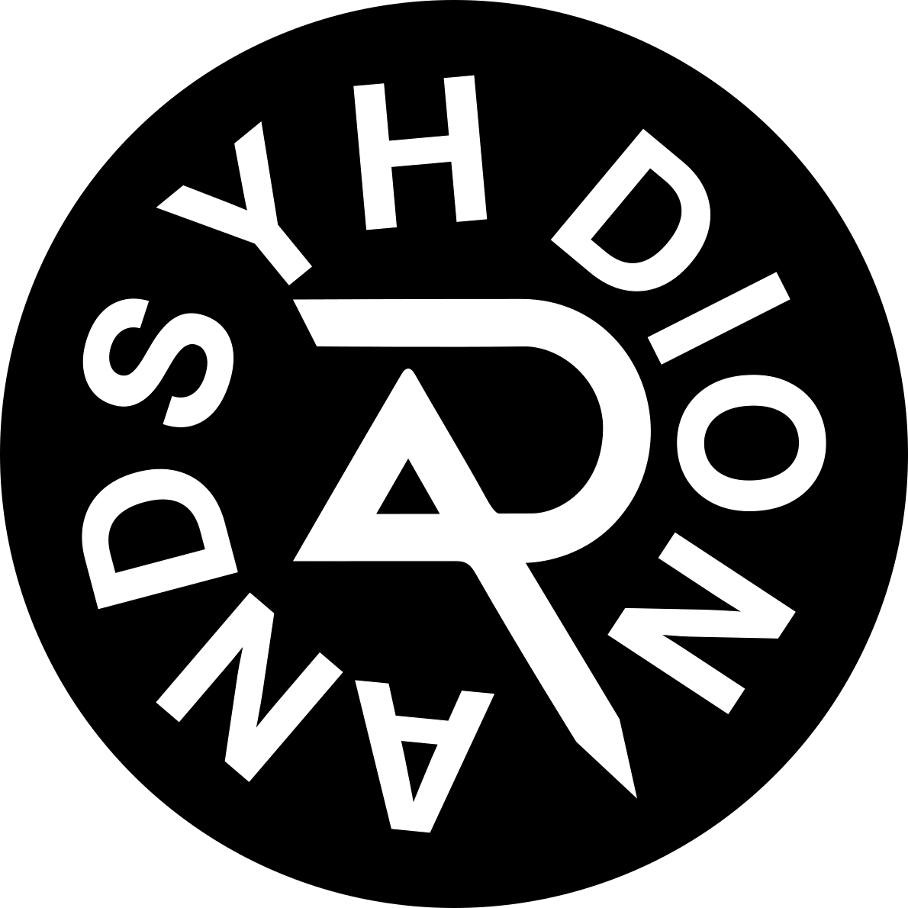

# 👋 Hi, I'm Dion Andreansyah (andsyh)

  
  
  **Frontend Developer & UI/UX Enthusiast**
  
  
  
  

## 🚀 About Me

I'm a passionate **Frontend Developer** with **8+ years of experience** in creating beautiful, performant, and accessible web applications. I specialize in modern web technologies and love integrating AI capabilities into user interfaces.

### 🛠️ Tech Stack

**Frontend Development:**
- React, TypeScript, Next.js, Redux
- HTML5, CSS3, Tailwind CSS
- D3.js, Chart.js for data visualization

**Backend & API Integration:**
- Node.js, Express
- Gemini API, REST API, GraphQL
- Socket.IO for real-time communication

**Tools & Design:**
- Git, GitHub for version control
- Figma for UI/UX design
- Docker, Webpack, Firebase

## 🎯 Featured Projects

### [Kalkulator Target Tabungan](https://kalkulator-target-tabungan.netlify.app/)
Aplikasi web untuk menghitung target tabungan dengan berbagai skenario investasi. Membantu perencanaan keuangan dengan kalkulasi yang akurat dan visualisasi yang jelas.

**Tech:** React, TypeScript, Tailwind CSS

### [Andsyh Convert](https://andsyh-convert.netlify.app/)
Konverter satuan modern yang mendukung berbagai jenis konversi seperti panjang, berat, suhu, dan mata uang. Interface yang intuitif dan responsif untuk kemudahan penggunaan.

**Tech:** React, TypeScript, Tailwind CSS

### [CV Builder](https://cv-builder-andsyh.netlify.app/)
Pembuat CV online yang memungkinkan pengguna membuat curriculum vitae profesional dengan template yang menarik. Fitur drag-and-drop dan preview real-time.

**Tech:** React, TypeScript, Tailwind CSS

### [To-Do List](https://andsyh-to-do-list.netlify.app/)
Aplikasi manajemen tugas yang memungkinkan pengguna membuat, mengedit, dan melacak daftar pekerjaan. Fitur drag-and-drop, filter, dan penyimpanan lokal.

**Tech:** React, TypeScript, Tailwind CSS

## 🤖 AI-Powered Portfolio

This portfolio features an **AI Assistant** powered by Google Gemini that can answer questions about my experience, projects, and skills. Try asking it anything!

## 🌟 What I Do

- **UI/UX Design**: Creating intuitive and beautiful user interfaces
- **Frontend Development**: Building responsive and performant web applications
- **AI Integration**: Incorporating AI capabilities into web applications
- **Mentoring**: Helping beginner developers grow their skills
- **Open Source**: Contributing to the developer community

## 📫 Get In Touch

- **Email**: dion.andreansyah@email.com
- **Portfolio**: [Live Demo](https://your-portfolio.netlify.app)
- **LinkedIn**: [Connect with me](https://linkedin.com/in/dionandreansyah)

## 🚀 Available for

- **Freelance Projects**
- **Full-time Opportunities**
- **Consulting**
- **Mentoring**

---

  <i>💡 Always learning, always building, always improving</i>

